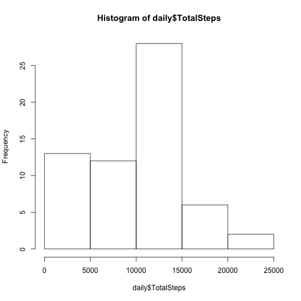
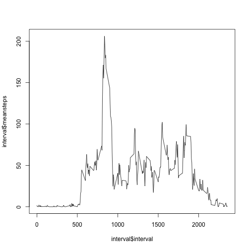
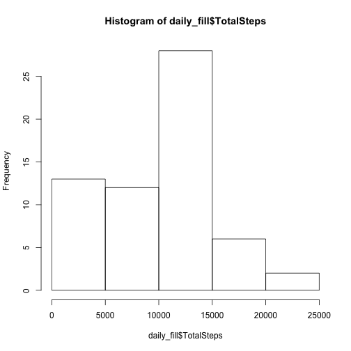
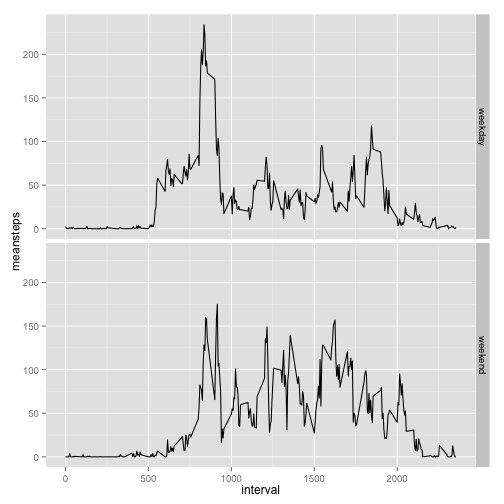

Repreducible Research - Assignment 1
=====================================
##Loading and preprocessing the data

1. Load the data


```r
activity <- read.csv("activity.csv")
```
2. Process/transform the data (if necessary) into a format suitable for your analysis

I don't see how it is necessary for now.

##What is mean total number of steps taken per day?

For this part of the assignment, you can ignore the missing values in the dataset.

1. Calculate the total number of steps taken per day. I don't know what it means to "ignore" the missing values. Here I'm removing them.

```r
library(plyr)
daily<-ddply(activity, "date", summarize, TotalSteps=sum(steps,na.rm=TRUE))
```
2. If you do not understand the difference between a histogram and a barplot, research the difference between them. Make a histogram of the total number of steps taken each day

```r
hist(daily$TotalSteps)
```

 

3. Calculate and report the mean and median of the total number of steps taken per day

```r
daily_mean<-mean(daily$TotalSteps)
daily_median<-median(daily$TotalSteps)
```
The mean of the total number of steps taken per day is 9354.2295082 and the median of the total number of steps taken per day is 10395.

##What is the average daily activity pattern?

1. Make a time series plot (i.e. type = "l") of the 5-minute interval (x-axis) and the average number of steps taken, averaged across all days (y-axis)

```r
interval<-ddply(activity, "interval", summarize, meansteps=mean(steps,na.rm=TRUE))
plot(interval$interval,interval$meansteps,type='l')
```

 

2. Which 5-minute interval, on average across all the days in the dataset, contains the maximum number of steps?

```r
max_interval<-interval[interval$meansteps==max(interval$meansteps),]$interval
```
835 contains the maximum number of steps on average across all the days in the dataset.

##Imputing missing values

Note that there are a number of days/intervals where there are missing values (coded as NA). The presence of missing days may introduce bias into some calculations or summaries of the data.

1. Calculate and report the total number of missing values in the dataset (i.e. the total number of rows with NAs)

```r
NAs<-activity[is.na(activity$steps),]
answer1<-nrow(NAs)
```
There are 2304 missing values in the dataset.

2. Devise a strategy for filling in all of the missing values in the dataset. The strategy does not need to be sophisticated. For example, you could use the mean/median for that day, or the mean for that 5-minute interval, etc.

I choose to use the median for that 5-minute interval to represent missin values.

3. Create a new dataset that is equal to the original dataset but with the missing data filled in.

```r
interval_median<-ddply(activity, "interval", summarize, mediansteps=median(steps,na.rm=TRUE ))
activity_fill<-activity
for (i in 1:nrow(activity)) {
    if (is.na(activity$steps[i])){
        activity_fill$steps[i]<-interval_median[interval_median$interval==activity$interval[i],]$mediansteps
    }
}
```
4. Make a histogram of the total number of steps taken each day and Calculate and report the mean and median total number of steps taken per day. Do these values differ from the estimates from the first part of the assignment? What is the impact of imputing missing data on the estimates of the total daily number of steps?

```r
daily_fill<-ddply(activity_fill, "date", summarize, TotalSteps=sum(steps,na.rm=TRUE))
hist(daily_fill$TotalSteps)
```

 

```r
daily_mean_fill<-mean(daily_fill$TotalSteps)
daily_median_fill<-median(daily_fill$TotalSteps)
```
After imputation, the means changed from 9354.2295082 to 9503.8688525 and the median changed from 10395 to 10395. The imputation based on the median raised the mean a little bit but did not affected the median. And by looking at the two histograms, the distributions looked alomost the same.

##Are there differences in activity patterns between weekdays and weekends?

For this part the weekdays() function may be of some help here. Use the dataset with the filled-in missing values for this part.

1. Create a new factor variable in the dataset with two levels – “weekday” and “weekend” indicating whether a given date is a weekday or weekend day.

```r
activity$weekday<-weekdays(as.POSIXlt(activity$date))
for (i in 1:nrow(activity)) {
    if (activity$weekday[i] %in% c("Saturday","Sunday")) {
        activity$work[i]<-"weekend"
    }
    else {
        activity$work[i]<-"weekday"
    }
}
```
2. Make a panel plot containing a time series plot (i.e. type = "l") of the 5-minute interval (x-axis) and the average number of steps taken, averaged across all weekday days or weekend days (y-axis). See the README file in the GitHub repository to see an example of what this plot should look like using simulated data.

```r
activity_weekday<-activity[activity$work=='weekday',]
activity_weekend<-activity[activity$work=='weekend',]
interval_weekday<-ddply(activity_weekday, "interval", summarize, meansteps=mean(steps,na.rm=TRUE),work='weekday')
interval_weekend<-ddply(activity_weekend, "interval", summarize, meansteps=mean(steps,na.rm=TRUE),work='weekend')
interval_total=rbind(interval_weekday,interval_weekend)
library(ggplot2)
qplot(x=interval,y=meansteps,facets=work~., geom="path",data=interval_total)
```

 
